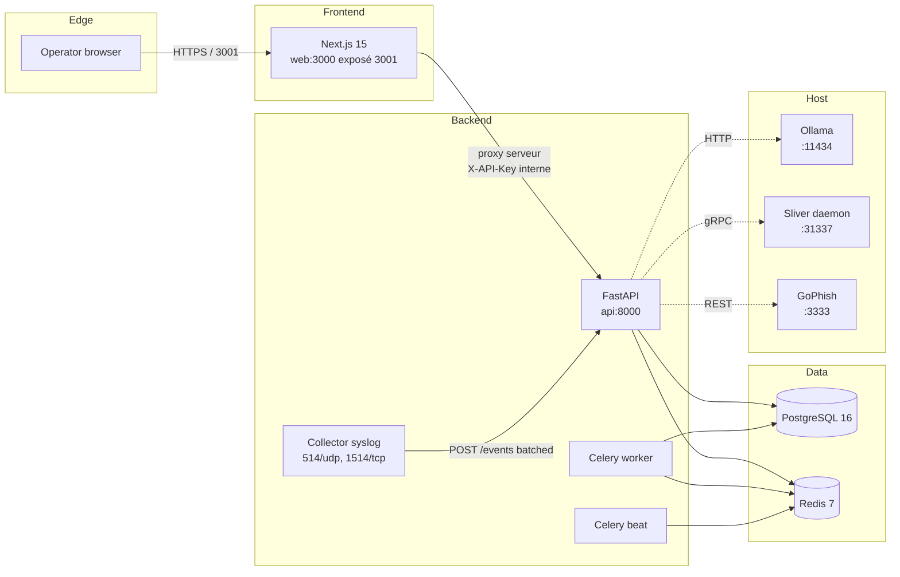
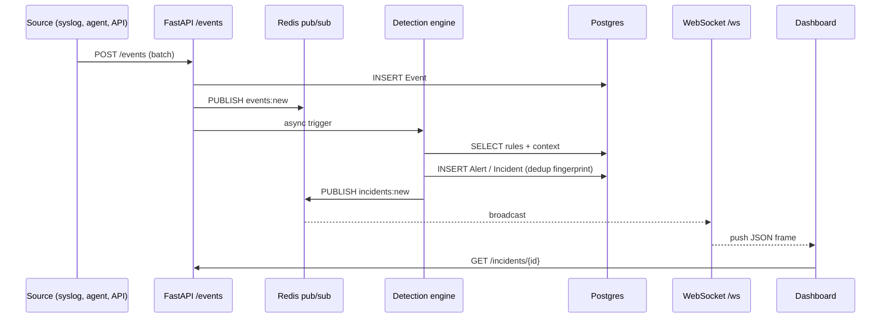
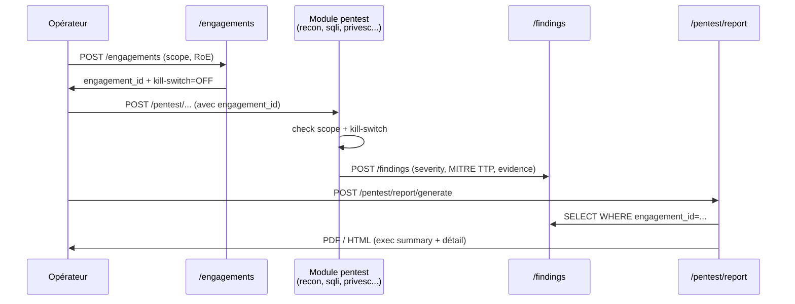
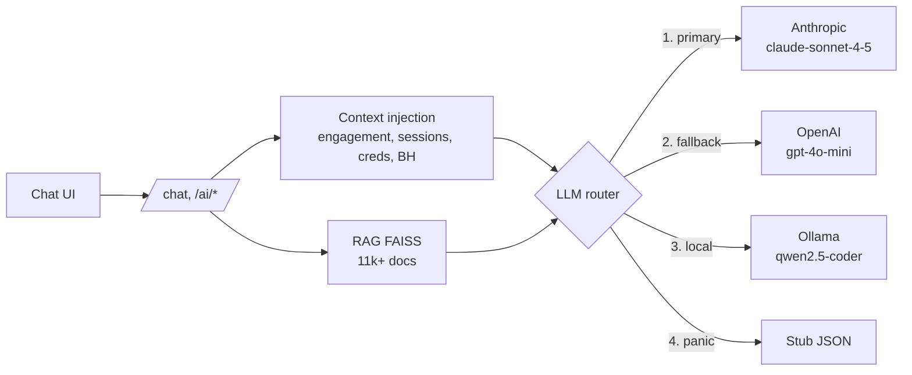

# Architecture — analyste-soc

Document de référence pour comprendre la topologie logicielle, les flux
principaux et les points d'intégration externes. Cible : nouveaux
contributeurs, opérateurs, auditeurs sécurité.

**Version couverte :** V4.9 (avril 2026).

---

## 1. Vue d'ensemble

La plateforme combine trois domaines historiquement séparés dans une même
interface opérateur :

| Domaine        | Rôle                                                        |
|----------------|-------------------------------------------------------------|
| SIEM           | Collecte, détection, incidents, threat intel                |
| Pentest        | 65+ modules offensifs (recon → post-exploit → rapport)      |
| Red Team / IA  | Sliver C2, GoPhish, BloodHound, assistant multi-provider    |

Le code est organisé en monorepo :

```
apps/
├── api/         FastAPI (Python 3.11+) — 750+ endpoints REST + WebSocket
├── web/         Next.js 15 App Router — 118 pages TypeScript
├── agent/       Simulateur d'événements (optionnel, profil dev)
└── collectors/  Ingestion Syslog UDP/TCP
```

Le backend et le frontend sont les deux artefacts déployables. Tout le
reste (Postgres, Redis, Celery, Sliver, GoPhish) est un service d'infra
orchestré par Docker Compose.

---

## 2. Topologie Docker Compose



**Résumé des ports exposés sur l'hôte :**

| Port hôte | Service     | Notes                                    |
|-----------|-------------|------------------------------------------|
| 3001      | `web`       | Dashboard opérateur (Next.js)            |
| 8000      | `api`       | FastAPI, `/docs` en dev uniquement       |
| 514/udp   | `syslog`    | Ingestion RFC 5424                       |
| 1514/tcp  | `syslog`    | Variante TCP                             |
| 3333      | `gophish`   | Admin GoPhish (profil `redteam`)         |
| 31337     | `sliver`    | gRPC operator (profil `redteam`)         |

La clé API n'est **jamais** exposée au navigateur : le frontend route
tous les appels via `apps/web/src/app/api/proxy/[...path]/route.ts`, qui
injecte `INTERNAL_API_KEY` côté serveur Next.

---

## 3. Flux temps réel — événement → incident



Points clés :

- **Déduplication** via la table `alert_fingerprint` (migration 014).
  Un hash composite `(rule_id, src_ip, user, window)` évite de créer
  100 incidents pour la même attaque.
- **Triage IA optionnel** (`TRIAGE_ENABLED=true`) enrichit l'incident
  avec un verdict Claude/Ollama avant broadcast (voir `apps/api/ai/triage.py`).
- **SOAR** écoute `incidents:new` et déclenche les playbooks correspondants.

---

## 4. Flux pentest — engagement → rapport



**Garde-fous obligatoires** (hardenings V4.6b) :

- **Scope check** : chaque module valide la cible contre le CIDR déclaré
  dans l'engagement ET contre `PENTEST_ALLOWED_TARGETS` (env).
- **Kill-switch** : flag par engagement ET flag global — si actif,
  tout module retourne `409 Conflict` immédiatement.
- **Audit log signé** : toute action offensive produit une entrée dans
  `pentest_audit_log` signée avec `AUDIT_SIGNING_KEY` (HMAC).

---

## 5. Red Team — Sliver, Phishing, BloodHound

### 5.1 Sliver C2 (V4.3)

- Le daemon tourne sur l'hôte (ou container profil `redteam`) et écoute
  gRPC sur `:31337`.
- L'API parle à Sliver via le client gRPC officiel (`apps/api/pentest/c2_sliver/client.py`).
- Un **poller asynchrone** (`poller.py`) récupère les beacons actifs et
  les pousse en Redis pub/sub (`redteam:events`).
- Le WebSocket `/c2/ws/operator` relaie ces événements à l'Operator
  Console frontend (`apps/web/src/app/redteam/`).
- Les configs opérateur sont stockées dans un volume Docker
  (`sliver_configs`) référencé par `SLIVER_OPERATOR_CFG`.

### 5.2 GoPhish (V4.6)

- Serveur GoPhish en container séparé (`:3333`), API REST via
  `GOPHISH_API_URL` + `GOPHISH_API_KEY`.
- Les templates, landing pages et campagnes sont gérés via
  `apps/api/routes/phishing.py`.
- **Scope enforcement** : avant envoi, la liste de destinataires est
  filtrée contre le scope domaine de l'engagement (`@client.tld` only).
- **Kill-switch** : endpoint `POST /phishing/campaigns/{id}/stop` arrête
  un envoi en cours et fige les templates.

### 5.3 BloodHound (V4.5)

- Import de dumps SharpHound (JSON zip) via `POST /bloodhound/datasets`.
- Stockage en base (`bloodhound_dataset`, migration 019), pas de Neo4j
  embedded — l'analyse se fait en SQL + post-processing Python.
- L'assistant IA peut lire les chemins d'attaque calculés et suggérer
  des pivots (lecture seule, pas de modification du dump).

---

## 6. Assistant IA — multi-provider



Ordre de priorité (voir `apps/api/ai/llm_client.py`, fonction `call`) :

1. Si `ANTHROPIC_API_KEY` présente → Claude (défaut `claude-sonnet-4-5`).
2. Sinon si `OPENAI_API_KEY` → GPT-4o-mini.
3. Sinon si `OLLAMA_ENABLED=true` (défaut) → Ollama local.
4. Dernier recours : réponse stub JSON déterministe (ne casse pas l'UI).

En cas d'erreur 429/5xx/timeout sur le primary, retry exponentiel (1/2/4s)
puis **fallback automatique** vers le provider suivant dans la liste.

**Cost tracking** : chaque appel insère dans `ai_cost_log` (migration 010)
et agrège un compteur Redis journalier pour le dashboard `/admin/ai-costs`.

**RAG** : index FAISS `all-MiniLM-L6-v2` (384 dim) construit via
`POST /ai/rag/rebuild`. Sources : MITRE ATT&CK, NVD CVE, SigmaHQ rules
(~11 000 docs).

---

## 7. Sécurité — auth, RBAC, secrets

### 7.1 Authentification duale

Deux mécanismes coexistent (voir ADR-0002) :

- **JWT Bearer** pour les utilisateurs humains via l'UI. Access token
  court (15 min, configurable `JWT_EXPIRE_MINUTES`), refresh token 7j,
  révocation Redis par `jti`.
- **X-API-Key** pour les appels service-à-service (syslog collector,
  agent simulateur, intégrations externes). Comparaison `hmac.compare_digest`.

Les deux sont acceptés sur la plupart des endpoints ; le middleware
`require_api_key` (`apps/api/security.py`) teste l'un puis l'autre.

### 7.2 RBAC

Hiérarchie de rôles (`apps/api/auth.py`) :

```
analyst (0) < lead (1) < admin (2)
```

La fonction `require_roles("admin")` protège les endpoints sensibles
(gestion utilisateurs, rotation secrets, kill-switch global). L'API key
partagée est traitée comme admin pour l'automatisation.

### 7.3 Secrets

- En dev : `.env` (ignoré par git, voir `.env.example`).
- En prod : overlay Docker `docker-compose.secrets.yml` qui monte
  `./secrets/*.txt` (mode 600) en tant que Docker secrets et les lit
  via `_FILE`.
- Rotation : `make secrets-init` régénère uniquement les fichiers
  manquants, puis `docker compose up -d --force-recreate api worker beat`.

### 7.4 Kill-switch global

Un flag global (table `engagements`, champ `global_kill_switch`) bloque
toute action offensive. Check en entrée de chaque module pentest/redteam.

---

## 8. Persistance & migrations

- **Postgres 16** est la source de vérité. 22 migrations Alembic versionnées
  dans `alembic/versions/` (tête actuelle : `022_chat_messages`).
- **Redis 7** : cache TI 2 niveaux, pub/sub temps réel, rate limiting
  (SlowAPI), sessions révoquées, compteurs coûts IA.
- **Volumes Docker** persistants : `pgdata`, `geoip_data`, `ml_models`,
  `rag_data`, `sliver_configs`, `sliver_builds`, `sliver_data`.

Les migrations sont appliquées **automatiquement au démarrage** de l'API
(lifespan hook, cf. `apps/api/main.py`). Si Alembic échoue, fallback sur
`Base.metadata.create_all` (dev uniquement).

---

## 9. Observabilité

- **Logs** structurés JSON en prod (`structlog`), request-id propagé
  dans chaque réponse (`X-Request-Id`).
- **Métriques** Prometheus exposées sur `/metrics` via
  `prometheus-fastapi-instrumentator`.
- **Traces** OpenTelemetry si `OTEL_EXPORTER_OTLP_ENDPOINT` défini.
  Trace-id et span-id injectés dans les logs via middleware.
- **Healthchecks** : `/livez` (process), `/readyz` (DB+Redis), `/health`
  (détaillé, rétrocompatible).
- **Stack monitoring** : `make monitoring-up` démarre Prometheus, Grafana,
  postgres-exporter, redis-exporter via `docker-compose.monitoring.yml`.

---

## 10. Où aller ensuite

- Setup machine dev : [`ONBOARDING.md`](./ONBOARDING.md).
- Décisions structurantes expliquées : [`adr/`](./adr/).
- Gestes d'exploitation : [`runbooks/`](./runbooks/).
- Référence API : [`api-reference.md`](./api-reference.md).
